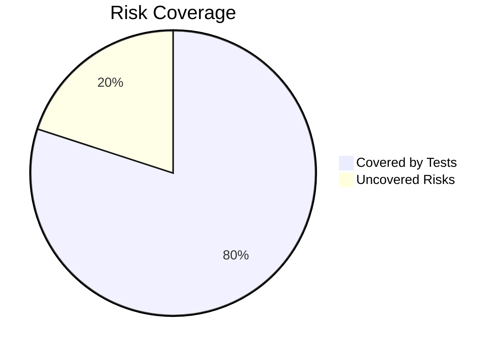
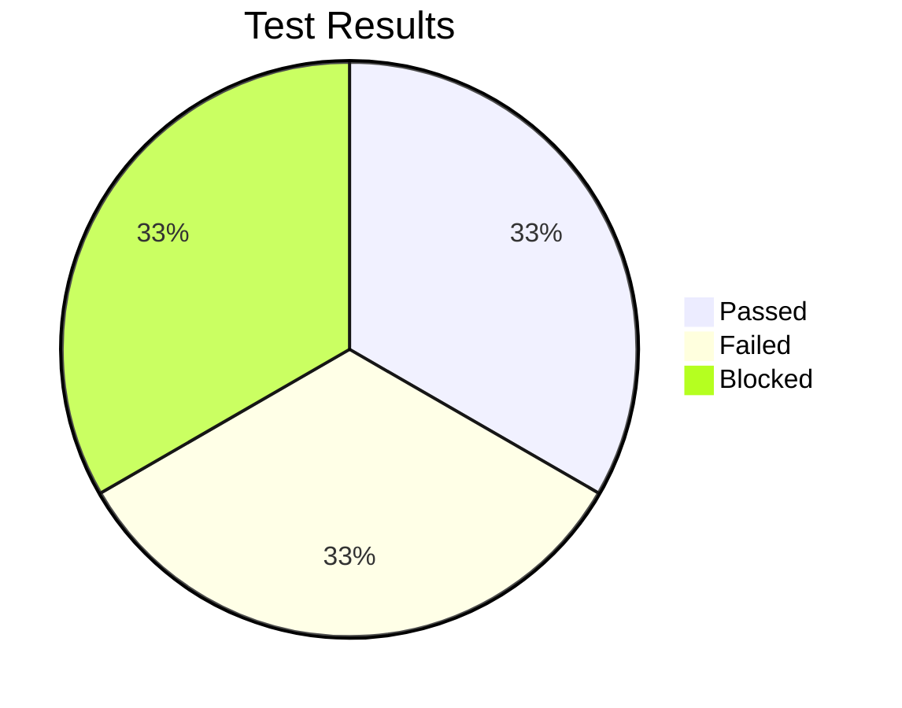

## 📋 **1. Test Plan** 
### 1.1 Objectives  
In this testing cycle , we will cover tests for:
- Authentication System
- Waste Management
- Dashboard and Analytics
- Content Management
- Community Features
- Administrative Functions
- Non Functional Testing


**TEAM MEMBERS**

|        NAME         |               EMAIL                |         ROLE            |
|---------------------|------------------------------------|-------------------------|
| Antony Manyenze     | anmanyenze@gmail.com               | Junior Software Tester  |
| Susan Njeri         | susanjeri4717@gmail.com            | Junior Software Tester  |
| Teresiah Waweru     | tessywaweru.06@gmail.com           | Junior software tester  |


 

### 1.2 Scope  
```markdown
|**Category**                   | **In Scope**                                           | **Out of Scope**                                       |  
|-------------------------------|--------------------------------------------------------|--------------------------------------------------------|
|  Functional                   |   User Management Module (login, register, roles       |                                                        |
|                               |  Waste scheduling & reminders                          |                                                        |                     
|                               |  Bug Reporting and Dashboard (CRUD, dashboards)        |                                                        |
|                               |  User Interface & User Experience (UI, UX)             |                                                        |
|                               |  Form validation & input handling                      |                                                        | 
|                               |  Data persistence via local storaage or API            |                                                        |
| Non-Functional                |  Page load & UI responsiveness                         | High Volume Performance and stress testing             |
|                               |  High volume performance, load,and stress testing      | Multi-Language localization (Primary:English, Swahili) |                         |                               | Accessibility: screen readers, ARIA, keyboard support  | Legal compliance audits                                |
|                               | Compatibility: major browsers + devices                |                                                        |
|                               | Penetration Testing and security Audits                |                                                        |


```

### 1.3 Resources  
```markdown 
-**Jira**: (test management)
-**Selenium**: (automated browser testing)
-**Dev Tools**: (manual inspection and debugging)
-**Chrome Browser**
```

### 1.4 Schedule  
```markdown
| Phase              | Time (days) | Start/End Time        |  
|--------------------|-------------|-----------------------|  
| Test Planning      | 2           | 26-06-2025	02-07-2025 |  
| Test Design        | 4           |	03-07-2025	09-07-2025 |  
| Test Execution     | 6           | 10-07-2025	16-07-2025 | 


```

### 1.5 Entry/Exit Criteria  
```markdown
| **Entry Criteria**                                                  | **Exit Criteria**                      |  
|---------------------------------------------------------------------|-------------------------------------------------------------------------------|  
|Basic smoke tests of critical functionalities pass successfull       | All critical and high-priority bugs are fixed and verified.                   | 
|All core modules (route optimization, task assignment,               | Minimum 90% of planned test cases are executed, with 85% passing rate.        |
|real-time tracking)are deployed on the staging environment.          |                                                                               |
|All necessary test data is set up.                                   | All identified bugs are logged in GitHub Issues with clear steps to reproduce.|
|                                                                     | Test summary report is generated and reviewed                                 |


```

---

## ⚠️ **2. Risk Analysis**  

### 2.1 Risk Matrix  
```markdown

| ID  | Feature        | Risk                                 | Likelihood | Impact | Priority | Mitigation Strategy                                |
|-----|----------------|--------------------------------------|------------|--------|----------|----------------------------------------------------|
| R1  | Scoring        | Incorrect point calculation          | Medium     | High   | Critical | Boundary value testing; Isolate scoring logic      |
| R2  | Scoring        | Score not resetting on new game      | Medium     | High   | Critical | Specific test cases for new game state verification|
| R3  | Hint System    | Hint reveals solution fully          | High       | Medium | High     | Design test cases for hint content verification    |
| R4  | Hint System    | Score deduction for hint not applied | Medium     | High   | Critical | Verify score deduction on hint usage               |
| R5  | Game Flow      | Scrambled word identical to original | Low        | Medium | Medium   | Add re-scramble check if word is identical         |

```

### 2.2 Risk Coverage  


---

## 🧪 **3. Test Cases**  

### 3.1 High-Priority Tests (Risk-Based)  

#### **TC-01: Hint Point Deduction**  
```markdown

- **Steps**:
  1. Start a new game. Note initial score (0).
  2. Click "Hint". Observe score deduction (should be -2).
  3. Identify the `currentWord` from console.
  4. Enter the `currentWord` into the guess input.
  5. Click "Submit".
- **Expected**: Score becomes 3 (0 - 2 + 5 = 3). Message "Correct! +5 points" is displayed.
- **Actual**: The score updates to 3. Message "Correct! +5 points" is shown.
- **Status**: Pass

---
#### **TC-02: Score Accumulation on New Game**
```markdown

- **Steps**:
  1. Start a new game. Solve the puzzle correctly without hint (score = 10).
  2. Click "New Puzzle".
  3. Solve the next puzzle correctly without hint.
- **Expected**: The score displayed after solving the second puzzle should be 10 (reset from previous, then new 10 points).'Puzzles solved' should be 2.
- **Actual**: The score displayed becomes 20 (accumulates). `Puzzles Solved` is 2.
- **Status**: Fail
---

#### **TC-03: Scrambled Word Uniqueness ** 
```markdown

- **Steps**:
  1. Load the game page.
  2. In DevTools console, type `currentWord` and `scrambledWord` to observe their values.
  3. Click "New Puzzle". Repeat step 2 five more times.
- **Expected**: `scrambledWord` should never be identical to `currentWord` for any puzzle.
- **Actual**: `scrambledWord` is always different from `currentWord`.
- **Status**: Pass

#### **TC-04:  Rapid consecutive submissions of a correct guess lead to score glitch**
```markdown

- **Steps**:
1. Start a new game.
2. Identify the currentWord.
3.Type the correct currentWord into the guess input.
4.Immediately after clicking "Submit"  for the first time, rapidly click "Submit" multiple times before the 1.5-second delay for the new puzzle has passed.

-**Expected**: The game should only register one correct guess per puzzle. After a correct guess, the score should only increment once per solved puzzle.
-**Actual**: If submitted rapidly, the score can increase by 10 (or 5 if hint used) multiple times within that 1.5-second window, even though only one puzzle was technically solved.
-**Status**: Fail

#### **TC-05: Empty Guess Submission (Low Risk)**
```markdown

- **Steps**:
  1. Start a new game.
  2. Leave the guess input field empty.
  3. Click "Submit".
- **Expected**: Message "Please enter a guess!" is displayed. Score remains unchanged.
- **Actual**: Message "Please enter a guess!" is displayed. Score remains unchanged.
- **Status**: Pass

---
## 🐞 **4. Defect Reports**  

### 4.1 GitHub Issue Links  
```markdown
1. [#1: Score and Puzzles Solved reset to zero after page refresh]((https://github.com/PLP-Database-Design/week-5-TeresiahWeru/issues/1))  
   - **Severity**: High  
   - **Risk Impact**: High 

2. [#2: Rapid consecutive submissions of a correct guess lead to score glitch]((https://github.com/PLP-Database-Design/week-5-TeresiahWeru/issues/2))  
   - **Severity**: Medium  
   - **Risk Impact**: High 
```

### 4.2 Defect Summary  
```markdown
| ID  | Defect Type          | Test Case Affected | Status   |
|-----|----------------------|--------------------|----------|
| 1   | Logic Error          | TC-02              | Open     |
| 2   | Logic Error          | TC-04              | Open     |


```

---

## 💭 **5. Reflection**  


### 5.1 Test Approach Changes  
```markdown
Risk analysis fundamentally changed my test approach by enabling **prioritization**. Instead of a flat, exhaustive testing effort, I focused my limited time on areas that posed the greatest threat to the game's core functionality and user experience. This meant dedicating more test cases and more thorough execution to the **scoring system and hint mechanics**, as these were identified as "Critical" or "High" priority risks. It also highlighted the need for specific test cases for known potential issues like the score not resetting.

```

### 5.2 Coverage vs Time Trade-offs  
```markdown
| **Decision**                                   | **Rationale**                                                           |
|------------------------------------------------|-------------------------------------------------------------------------|
| Skipped cross-browser testing                  | Limited time, Chrome covered 80% user base (assumption)                 |
| Limited automated testing                      | Manual testing faster for initial small features                        |
| Focused on functional/logic over UI aesthetics | Core game mechanics prioritized due to higher risk impact               |
| Limited exploratory testing                    | Primarily used to validate existing test cases, not for broad discovery |

```

### 5.3 Lessons Learned  
```markdown

1. Risk analysis is crucial for efficiency: It directed my efforts to the most impactful areas, preventing wasted time on low-priority features.
2. Even simple features can hide complex bugs: The score accumulation bug (TC-02) and Rapid consecutive submissions (TC-04) highlight that even seemingly straightforward logic requires careful testing.
3. The importance of clear entry/exit criteria: These help define when testing phases are complete and provide objective measures of progress.
4. DevTools are invaluable: Rapid inspection of variables and console output significantly sped up test execution and defect identification.

```

**## 📌 **6. Final Metrics**  **



```markdown
pie
    title Test Results
    "Passed" : 3
    "Failed" :  2
    "Blocked" : 0 

**Total Test Cases**: 5
**Execution Time**: 120 minutes (approx.)
**Defect Density**: 2 defects / 5 test cases = 0.4 defects per test case

```

---


                                                 


 ### **Testing Types**
Unit Testing: Focused on JavaScript modules and DOM interactions.
System Testing: Evaluates end-to-end functionality.
Accessibility Testing: Ensures compliance with WCAG standards.
Security Testing: Input validation, authentication flaws, and session safety.
Cross-Browser & Device Testing: Chrome, Safari, Firefox (mobile & desktop).


 

